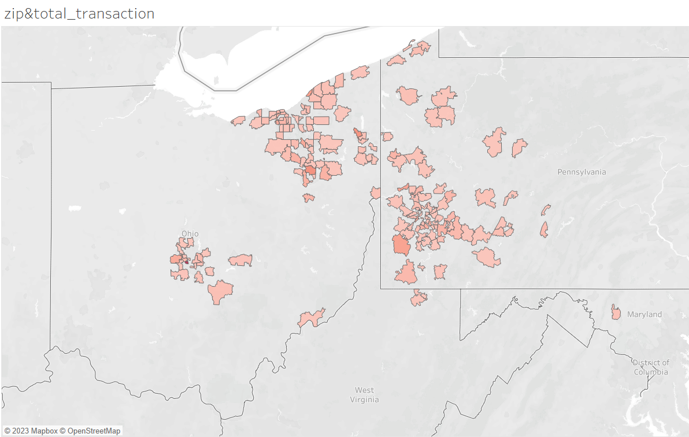

```{r setup, include=FALSE}
knitr::opts_chunk$set(echo = TRUE)
```
#environment setting
##clean
```{r}

  rm(list = ls()) # Clear all files from your environment
  gc()            # Clear unused memory
  cat("\f")       # Clear the console
  graphics.off()  # Clear all graphs
```

##package
```{r}
packages <- c("psych",       # quick summary stats for data exploration,
              "stargazer",   # summary stats,
              "summarytools",# summary stats,
              "naniar",      # for visualisation of missing data,
              "visdat",      # for visualisation of missing data,
              "VIM",         # for visualisation of missing data,
              "DataExplorer",# for visualisation of missing data,
              "tidyverse",   # data manipulation like selecting variables,
              "fastDummies", # Create dummy variables using fastDummies,
              "corrplot",    # correlation plots,
              "ggplot2",     # graphing,
              "data.table",  # reshape for graphing, 
              "car",
              "seasonal",
              "fpp3",
              "tsibble",    # vif for multicollinearity
              "cli",
              "crayon",
              "dplyr",
              "fable",
              "fabletools",
              "feasts",
              "lubridate",
              "magrittr",
              "purrr",
              "rstudioapi",
              "tibble",
              "tidyr",
              "tsibbledata",
              "latex2exp",
              "GGally",
              "broom"
              )


for (i in 1:length(packages)) {
  if (!packages[i] %in% rownames(installed.packages())) {
    install.packages(packages[i]
                     , repos = "http://cran.rstudio.com/"
                     , dependencies = TRUE
                     )
  }
  library(packages[i], character.only = TRUE)
}

rm(packages)
```

#data introduction
##import data
```{r}
setwd(getwd())
rawdata = read.csv("petfood_retail_table.csv")
```

##check the data dimensions
```{r}
dim(rawdata)
```

##data structure
```{r}
str(rawdata)
```

##data description
```{r}
summary(rawdata)
```

##summarize the data type
```
'''
~~~~~~~~~~~~~~~~~~~~~~~~~~~~~~~~~~~~~~~~~~~~~~~~~~~~~~~~~~~~~~~~~~~~~~~~~~~~~~~
#chr: 
1.Date: set as tsibble and then transfer into weeekly data for the analysis
2.shopper_basket:group_by together with shopper_id, using summarise later
3.manu_id:manufacterer_id, potential relationship with customer loyalty
4.brand_id:together with 3 or 5?
5:sub_brand_id: together with 4, maybe 3
6.species: cat or dog
7.food_type: dry and wet
8.price_tier:users may have specific preferences for someprice_tier?
9.package_size:interesting, preferences
10.feeding_philosophy:maybe we can find out the pet type in users house nad predict their pet's longevity?? what if they do after pets died, number of pet according to frequency?
whether the users get new pet in their home?
11.natural claim: the food is natural or not?
12.texture_format:good evidence for whether there is new pet
13.lifestage:
#int:
14.shopper_id:user_id, good for trace individual behaviors.
15.store_id:trace the place where user live, check whether they move with pet?
16.zipcode:this research need to do with tableau, maybe a total new part
17.product:product_id, useful in filter maybe
18.base_price:price for product
19.price:finally sold price
20.promo_flag:whether it's on promotion
21.unit:units sold for each transaction based on the index_columns, time
#num:
~~~~~~~~~~~~~~~~~~~~~~~~~~~~~~~~~~~~~~~~~~~~~~~~~~~~~~~~~~~~~~~~~~~~~~~~~~~~~~~~
#some basic information: 
1.longevity of pet? junior, senior, adult time period for pet?
'''
```
##check the missing value
```{r}
naniar::gg_miss_var(rawdata)
#no missing value!
```

##correlation map(maybe transter some categorical variables??)
```{r}
num_variables = c("")
cor(rawdata[,c("PROMO_FLAG","UNITS")])
#corrplot... worth researchong the categorical data??
```


##create tsibble dataset
```{r eval=FALSE, include=FALSE}
tsibble_day <- rawdata |>
               mutate(day = date(DATE)) |>
               as_tsibble(KEY = C(UNITS),index = day) 
tsibble_day
```
##show distinct users
```{r}
length(unique(rawdata$SHOPPER_ID))
```
#EDA
##make a model to predict single user
'''
1.user in same zipcode first

'''
##which user buy the most
```{r}
#!SAMEDAY == SAME SHOPPER_BASKET
t_rawdata <- rawdata |> mutate(DATE = as.Date(DATE, format = "%Y-%m-%d" ))
t_aggr_trans <- t_rawdata  |> mutate(transaction = PRICE*UNITS) |>                              
                              group_by(SHOPPER_ID,DATE) |>
                              select(DATE,SHOPPER_ID,transaction) |>
                              summarise(transaction_day = sum(transaction))
#group by in sequence then you can add
t_aggr_trans_all <- t_aggr_trans |> select(SHOPPER_ID,transaction_day) |>
                                    summarise(transaction_user = sum(transaction_day))

t_aggr_trans_all[which.max(t_aggr_trans_all$transaction_user),]
#Then I will use some left join and left join create more graphs!!!
```

##generate a new column transaction
```{r}
t_rawdata_trans <- t_rawdata |> mutate(transaction = PRICE*UNITS)
```

##create the colnames
```{r}
colnames(rawdata)
```


##which user buy the most averagely

##combine user ID and ZIPCODE, the max user and zip_code
```{r}
user_zipcode <- distinct(rawdata |> select(SHOPPER_ID,ZIP_CODE))
t_aggr_trans_all_zip <- t_aggr_trans_all |> left_join(user_zipcode, by = "SHOPPER_ID")
##then trying to list top10
#????????????????????????????????????
t_aggr_trans_all_zip[ order(desc(t_aggr_trans_all$transaction_user)),][1:10,]
##average sale from starting date to ending date
```
##create dataset for time_series data
```{r}
sum(rawdata$SHOPPER_ID == "2857978")
tssible_test <- t_aggr_trans |> 
                filter(SHOPPER_ID == "2857978") |>
                mutate(DATE = ymd(DATE)) |>
                as_tsibble(key = c(SHOPPER_ID), index = DATE)
autoplot(tssible_test, transaction_day)                               
```

```{r}
tssible_test <- t_aggr_trans |> 
                filter(SHOPPER_ID == "2857978") |>
                mutate(DATE = yearmonth(DATE)) |>
                group_by(SHOPPER_ID,DATE) |>
                summarise(transaction_month = sum(transaction_day)) |> 
                as_tsibble(key = c(SHOPPER_ID), index = DATE)
autoplot(tssible_test, transaction_month)
```

##lags map
```{r}
tssible_test |> gg_lag(transaction_month,geom = "point") + labs(x = "lag(transaction_month,k)")
```

##ACF
```{r}
tssible_test |> ACF(transaction_month) |> autoplot() + labs(title = "the user spent most")
#absolutely no white noise data
```


##some stl models
```{r}
tssible_test |> model(stl = 
                        STL(transaction_month ~ trend(window = 21) + 
                            season(window = "periodic"),
                            robust = TRUE)) |>
                            components() |> 
                            autoplot()
```
##show stl
```{r}
STL_VALUE <- tssible_test |> model(stl = 
                        STL(transaction_month ~ trend(window = 21) + 
                            season(window = "periodic"),
                            robust = TRUE)) |>
                            components()
STL_VALUE
```

##
then compare to some users in the same zipcode
```{r}
unique(rawdata$ZIP_CODE)
##which zip_code sells the most
user_zip <-  t_rawdata_trans |> select(ZIP_CODE,transaction) |>                                                                  group_by(ZIP_CODE) |>
                                summarise(Transaction_zip = sum(transaction))
                                
user_zip <- user_zip |> arrange(desc(Transaction_zip))
##zipcode and seasonal data
head(user_zip,10)
##write csv for the use of tableau
write.csv(user_zip, file = "zip_transaction.csv", row.names = FALSE)


#maybe we can show the distribution based on the manufacturer??
##people with different zipcode..... hard to analysis
##report user of different zipcode
#some people shop in different zipcode???
```

##tableau map

model suggestion
naive, seasonal naive, drift


#Monthly Time series data prediction
```{r}
#create dataset for manufacturer id and monthly data aggregate
manu_mars <- rawdata |> filter(MANU_ID == "MARS") |> 
                        select(DATE,PRICE,UNITS) |>
                        mutate(DATE = yearmonth(DATE)) |>
                        mutate(transaction = PRICE*UNITS) |>
                        group_by(DATE) |>
                        summarise(transaction = sum(transaction))
manu_mars_monthly_tsibble <- as_tsibble(manu_mars, index = "DATE")
manu_mars_monthly_tsibble
##turn to tsibble
```


##easy autolpot map
```{r}
manu_mars_monthly_tsibble |> filter(!is.na(transaction)) |>                                                                                gg_tsdisplay(transaction,plot_type = "partial")
```
use gg_tsdisplay to show the ACF and PACF
There is no evidence of changing variance, so we will not do a Box-Cox transformation.

```{r}
monthly_dcmp <- manu_mars_monthly_tsibble |> filter(!is.na(transaction)) |>
                model(stl = STL(transaction))
components(monthly_dcmp) |> autoplot()
```

I don't think we will try log transformation in this place
maybe we can try??
First we should remove inflation??

KPSS test first
```{r}
manu_mars_monthly_tsibble |>
  features(transaction, unitroot_kpss)
```
Consequently, small p-values (e.g., less than 0.05) suggest that differencing is required. 

We need to make difference first to eliminate the seasonal influence
using the unitroots
```{r}
manu_mars_monthly_tsibble |> features(transaction, unitroot_nsdiffs)
manu_mars_monthly_tsibble |> features(transaction, unitroot_ndiffs)
```
0 suggests no seasonal differencing
1 suggests we should do both a first difference.
Then let's do first differencing and test kpss again
finally we replace the data
```{r}
manu_mars_monthly_tsibble |> mutate(transaction = difference(transaction)) |>
                             features(transaction, unitroot_kpss)
manu_mars_monthly_tsibble_first_differencing <- manu_mars_monthly_tsibble |> mutate(transaction = difference(transaction))
```


```{r}
manu_mars_monthly_tsibble_first_differencing |> filter(!is.na(transaction)) |>                                                                                gg_tsdisplay(transaction,plot_type = "partial")
```
But acf is still awful in the previous periods
Then we have solved the data problems now
It's enough!!!! Based on this map we can choose p,q for ARIMA(p,d,q)
When looking at ACF plot, we ignore the long spike at lag 0 
For PACF, the line usually starts at 1.
In this ACF and PACF maps, not tail off, but only cut off,
we find the spike for ACF shows MA(1) and MA(3)
we find the spike for PACF shows AR(1) and AR(2)
Then is the combination of those a ARMA models
Then because we have first_differencing for once, we will have ARIMA(p,1,q) model for this regression model
Then we can create our model
##ARIMA models
```{r}
arima_fit <- manu_mars_monthly_tsibble_first_differencing |> 
             filter(!is.na(transaction)) |> 
             model(
                   arima110 = ARIMA(transaction ~ pdq(1,1,0)),
                   arima013 = ARIMA(transaction ~ pdq(0,1,3)),
                   arima011 = ARIMA(transaction ~ pdq(0,1,1)),
                   arima210 = ARIMA(transaction ~ pdq(2,1,0)),
                   stepwise = ARIMA(transaction),
                   search = ARIMA(transaction, stepwise=FALSE)
  )
arima_fit
glance(arima_fit) |> arrange(AICc) |> select(.model:BIC)
```
```{r}
arima_fit |> select(arima013) |> gg_tsresiduals()
```
The residuals of this model looks good

```{r}
augment(arima_fit) |> filter(.model == "arima013") |> features(.innov, ljung_box, lag = 10, dof = 3)
```
A portmanteau test (setting  K=3, because p+q =3) returns a large p-value, also suggesting that the residuals are white noise.
Then we can make predictions now
```{r}
forecast_arima <- arima_fit |> forecast(h=12) |> filter(.model=='search') 
manu_mars_monthly_tsibble |> autoplot(transaction) + autolayer(forecast_arima)
```
??how to show the interval on the graph
??how to add the first differencing
Then lets add back the trend


BE CAREFUL TO DEAL WITH THE FIRST MISSING DATA IN DIFFRENCING USING !is.na(factor)
##use multiple models to predict
```{r}
#then is prediction, together with metrics  little bit seasonal
#arima ets each has lots of arguments
#add some senario forecastings
fit_monthly <- manu_mars_monthly_tsibble_first_differencing |> filter(!is.na(transaction)) |> model(
               ETS = ETS(transaction ~ error("A") + trend("A") + season("A"))
               )
monthly_forecast <- forecast(fit_monthly, h = 24)
manu_mars_monthly_tsibble_first_differencing |> autoplot(transaction) + autolayer(monthly_forecast)  #add something else
```
How can we add the differencing data back?
How to use that: Hyndman-Khandakar algorithm for automatic ARIMA modelling


##test
portmanteau test ?
AIC BIC AICc

#Weekly time series data prediction

##data set create
```{r}
manu_mars <- rawdata |> filter(MANU_ID == "MARS") |> 
                        select(MANU_ID,DATE,PRICE,UNITS) |>
                        mutate(DATE = yearweek(DATE)) |>
                        mutate(transaction = PRICE*UNITS) |>
                        group_by(MANU_ID,DATE) |>
                        summarise(transaction = sum(transaction)) |>
                        select(MANU_ID,DATE,transaction) 
manu_mars_weekly_tsibble <- as_tsibble(manu_mars, index = DATE)
manu_mars_weekly_tsibble
```

kpss first
```{r}
manu_mars_weekly_tsibble |> features(transaction,unitroot_kpss)
```
bad, let's nsdiff
```{r}
manu_mars_weekly_tsibble |> features(transaction,unitroot_nsdiffs)
manu_mars_weekly_tsibble |> features(transaction,unitroot_ndiffs)
```
no need to seasonal differencing, only first differencing now. The test kpss and replace that instead
```{r}
manu_mars_weekly_tsibble |> mutate(transaction = difference(transaction)) |> features(transaction,unitroot_kpss)
manu_mars_weekly_tsibble_first_differencing <- manu_mars_weekly_tsibble  |> mutate(transaction = difference(transaction)) 
```


## 3 breakdowns for trend
```{r}
weekly_dcmp <- manu_mars_weekly_tsibble_first_differencing |>
                model(stl = STL(transaction))
components(weekly_dcmp) |> autoplot()
```

```{r}
fit_weekly <- manu_mars_weekly_tsibble_first_differencing |> model(
               ETS = ETS(transaction ~ error("A") + trend("A") + season("N")),
               SARIMA = ARIMA(tsib, xreg = fourier(K = 6))
               )
weekly_forecast <- forecast(fit_weekly, h = 12)
manu_mars_monthly_tsibble_first_differencing |> autoplot(transaction) + autolayer(weekly_forecast)  #add something else
```


##predictioN 

SLIDES AND DRAFT


I need to summarize the model and figure out when to use in the model.

#REVISION
should we remove inflation